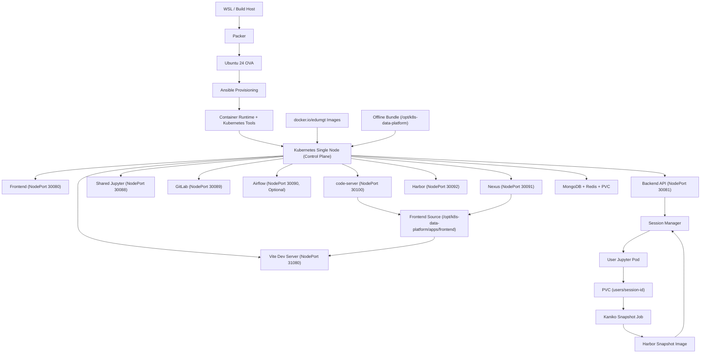
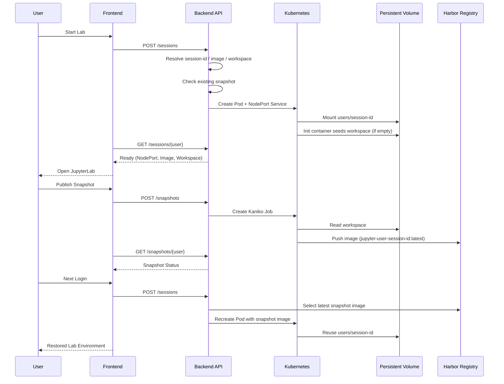

# k8s-data-platform-ova

🌐 **English** | [中文](README.zh.md) | [日本語](README.ja.md) | [한국어](README.md)

This repository provides a practice/production platform built on the `Ubuntu 24 OVA → kubeadm single-node Kubernetes → platform workloads` stack. The runtime is **not** Docker Compose — it uses `Kubernetes manifest + kustomize overlay + kubeadm/bootstrap`. The OVA is pre-loaded with Docker Engine, containerd, kubeadm, kubelet, kubectl, vim, curl, Node.js, Python, image caches, and an offline bundle.

This README also highlights the following operational perspectives on top of the Kubernetes-focused description:

- End-to-end workflow for testing immediately after OVA import into VirtualBox / VMware
- Service access patterns in air-gapped (offline) environments
- Frontend development environment (`code-server`, `Vite`, `npm offline`) usage
- Offline bundle import / validation checklist

Key requirements implemented:

- Per-user JupyterLab sessions created as Kubernetes Pod/Service
- Per-user workspace persisted via `PVC subPath`
- Workspace snapshotted into a Harbor image via Kaniko Job
- Snapshot image restored on next login
- Platform common images pulled from `docker.io/edumgt/*`
- OVA pre-loaded with Docker Engine, utilities, platform images, and offline library bundles

## Kubernetes Architecture

The current stack is pure Kubernetes.

- Host runtime: `Ubuntu 24`
- Cluster: `kubeadm`-based single-node Kubernetes
- Deployment: `infra/k8s/base` + `infra/k8s/overlays/dev|prod`
- Workloads: `backend`, `frontend`, `mongodb`, `redis`, `airflow (optional)`, `jupyter`, `gitlab`, `gitlab-runner`, `nexus`
- User Jupyter sessions: backend creates per-user Pod/Service via Kubernetes API

## Directory Layout

```text
.
├── apps/
│   ├── airflow/          # Airflow image + DAG
│   ├── backend/          # FastAPI API + k8s session/snapshot control
│   ├── frontend/         # Quasar(Vue 3) dashboard
│   └── jupyter/          # JupyterLab image + bootstrap workspace
├── ansible/              # OVA guest provisioning, Docker/Kubernetes/bootstrap
├── infra/
│   ├── harbor/           # Harbor snapshot integration notes
│   └── k8s/              # base manifests + dev/prod overlays + runner overlay
├── packer/               # Ubuntu 24 OVA template
└── scripts/              # build/publish/apply/offline helper scripts
```

## Architecture Flowchart



## Jupyter Snapshot Sequence



## Quick Start

### 1. Prepare OVA variables

```bash
cp packer/variables.pkr.hcl.example packer/variables.pkr.hcl
```

### 2. Build OVA

```bash
bash scripts/run_wsl.sh --skip-export
```

To include OVA export in one shot:

```bash
bash scripts/run_wsl.sh
```

### 3. Docker Hub mirror + local Kubernetes runtime import

```bash
bash scripts/build_k8s_images.sh --namespace edumgt --tag latest
```

To push to Docker Hub:

```bash
docker login
bash scripts/publish_dockerhub.sh --namespace edumgt --tag latest
```

### 4. Apply Kubernetes

```bash
bash scripts/apply_k8s.sh --env dev
```

Reset and re-apply:

```bash
bash scripts/reset_k8s.sh --env dev
bash scripts/apply_k8s.sh --env dev
```

Check status:

```bash
bash scripts/status_k8s.sh --env dev
```

### 5. GitLab Runner overlay

```bash
bash scripts/apply_k8s.sh --env dev --with-runner
kubectl scale deployment/gitlab-runner -n data-platform-dev --replicas=1
```

### 6. Nexus Offline Repository

```bash
bash scripts/apply_k8s.sh --env dev
bash scripts/setup_nexus_offline.sh --namespace data-platform-dev --nexus-url http://127.0.0.1:30091
```

## Post-OVA-Import Testing

VMware-specific procedure: [docs/vmware/README.md](docs/vmware/README.md)

### Recommended VM Specs

- CPU: 4 cores or more
- Memory: 16 GB or more
- Disk: 100 GB or more
- NIC: `Bridged Adapter` recommended

### Web Access

- Frontend: `http://<OVA_IP>:30080`
- Backend: `http://<OVA_IP>:30081`
- Jupyter: `http://<OVA_IP>:30088`
- GitLab: `http://<OVA_IP>:30089`
- Nexus: `http://<OVA_IP>:30091`
- Harbor: `http://<OVA_IP>:30092`
- code-server: `http://<OVA_IP>:30100`
- Frontend Dev: `http://<OVA_IP>:31080`

## Frontend / API

- Login accounts
  - user: `test1@test.com / 123456`
  - user: `test2@test.com / 123456`
  - admin: `admin@test.com / 123456`
- Regular users start/stop/restore only their own Jupyter sandbox
- Admins view per-user sandbox status, session time, cumulative usage, login count, and launch count in admin mode
- Backend API endpoints:
  - `POST /api/auth/login`
  - `GET /api/auth/me`
  - `POST /api/auth/logout`
  - `POST /api/jupyter/sessions`
  - `GET /api/jupyter/sessions/{username}`
  - `DELETE /api/jupyter/sessions/{username}`
  - `GET /api/jupyter/snapshots/{username}`
  - `POST /api/jupyter/snapshots`
  - `GET /api/admin/sandboxes`

## Frontend Development Environment

This OVA provides not only the production frontend but also a **Vue development environment inside an air-gapped network**.

- Production Frontend: Kubernetes NodePort `30080`
- Dev Frontend: Vite dev server `31080`
- IDE: `code-server` `30100`
- Package supply: Nexus npm registry + offline npm cache

### Access code-server

```text
http://<OVA_IP>:30100
```

Then open:

```text
/opt/k8s-data-platform/apps/frontend
```

### Install dependencies

```bash
bash /opt/k8s-data-platform/scripts/frontend_dev_setup.sh
```

### Start dev server

```bash
bash /opt/k8s-data-platform/scripts/run_frontend_dev.sh
```

Open browser: `http://<OVA_IP>:31080`

## Offline / Air-gap Strategy

1. Boot base cluster with preloaded OVA images and tools
2. Import required images/packages from `offline-bundle`
3. Serve Python / npm package caches via Nexus
4. Use Harbor only as a per-user snapshot registry
5. All external access via `NodePort`

```bash
bash scripts/prepare_offline_bundle.sh --out-dir dist/offline-bundle
bash scripts/import_offline_bundle.sh --bundle-dir dist/offline-bundle --apply --env dev
```

## Key NodePorts

| Service | NodePort |
|---|---|
| Frontend | 30080 |
| Backend API | 30081 |
| JupyterLab | 30088 |
| GitLab Web | 30089 |
| Airflow | 30090 |
| Nexus | 30091 |
| Harbor | 30092 |
| code-server | 30100 |
| Frontend Dev (Vite) | 31080 |
| GitLab SSH | 30224 |

## Image Strategy

- `docker.io/edumgt/k8s-data-platform-backend:latest`
- `docker.io/edumgt/k8s-data-platform-frontend:latest`
- `docker.io/edumgt/k8s-data-platform-airflow:latest`
- `docker.io/edumgt/k8s-data-platform-jupyter:latest`

Harbor is used **only** as a per-user Jupyter snapshot registry, not as a general image registry.

## VirtualBox Multi-node Expansion

Automatically create/join/distribute 3 worker VMs from an existing control-plane VM:

```powershell
powershell -ExecutionPolicy Bypass -File .\scripts\bootstrap_virtualbox_multinode.ps1 `
  -ControlPlaneVmName k8s-data-platform `
  -WorkerNamePrefix k8s-worker `
  -WorkerCount 3 `
  -Username ubuntu `
  -Password ubuntu `
  -ForceRecreateWorkers
```

Multi-node overlay path: `infra/k8s/overlays/dev-multinode`

```bash
bash scripts/apply_k8s.sh --env dev --overlay dev-multinode
```

## GitHub Actions

- Workflow: `.github/workflows/publish-images.yml`
- Required secrets: `DOCKERHUB_USERNAME`, `DOCKERHUB_TOKEN`

## OVA Validation (2026-03-18)

- VM console capture: `docs/screenshots/ova-proof-vm-console.png`
- Full validation log: [docs/ova-proof-20260318.md](docs/ova-proof-20260318.md)

Known gap: `nexus` pod image pull failed for `docker.io/edumgt/platform-nexus3:3.90.1-alpine`.

---


---

## 💖 Sponsor

If this project has been helpful, please consider sponsoring to support continued development.

[](https://github.com/sponsors/edumgt)
[](https://buymeacoffee.com/edumgt)

Sponsorship funds are used for:

- Cloud infrastructure costs (CI/CD, image registry, test environments)
- New feature development and maintenance
- Documentation improvements and multilingual support
- Educational content and tutorial creation

> Thank you! Your support keeps this project growing.
