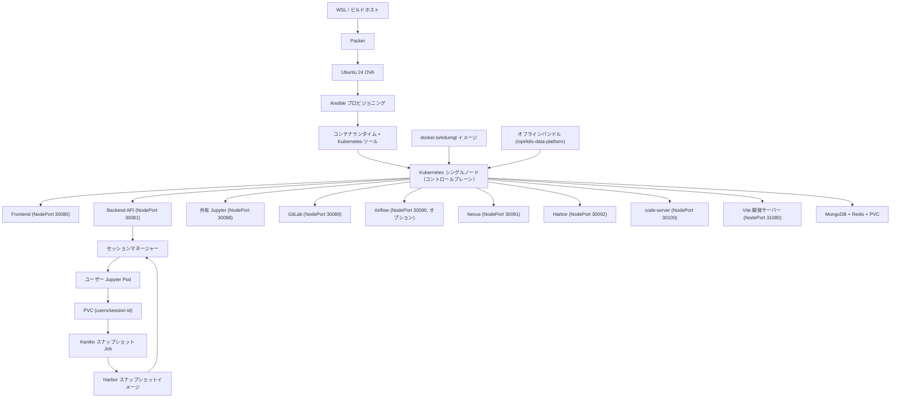
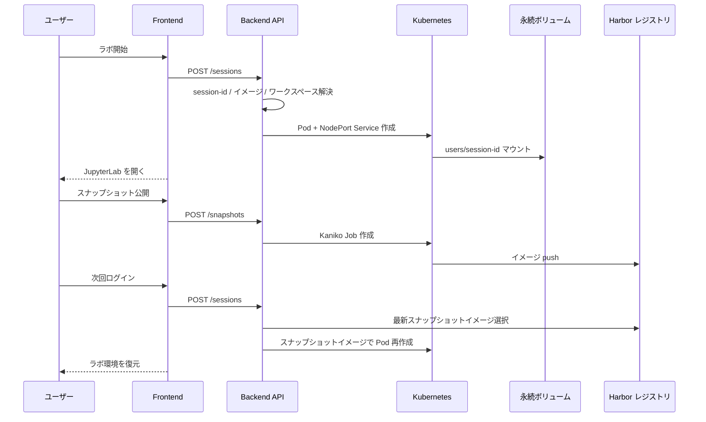

# k8s-data-platform-ova

🌐 [English](README.en.md) | [中文](README.zh.md) | **日本語** | [한국어](README.md)

このリポジトリは `Ubuntu 24 OVA → kubeadm シングルノード Kubernetes → プラットフォームワークロード` 構成をベースにした実習・運用プラットフォームです。実行基準は Docker Compose ではなく `Kubernetes manifest + kustomize overlay + kubeadm/bootstrap` であり、OVA 内には Docker Engine、containerd、kubeadm、kubelet、kubectl、vim、curl、Node.js、Python、イメージキャッシュ、オフラインバンドルがあらかじめ含まれています。

この README では、Kubernetes 中心の説明に加えて以下の運用観点も整理しています：

- OVA を VirtualBox / VMware にインポートした直後からテストできるフロー
- エアギャップ（オフライン）環境でのサービスアクセス方式
- フロントエンド開発環境（`code-server`、`Vite`、`npm offline`）の利用手順
- オフラインバンドル import / 検証チェックリスト

主な実装要件：

- ユーザーごとの JupyterLab セッションを Kubernetes Pod/Service として作成
- ユーザーごとのワークスペースを `PVC subPath` で永続化
- ワークスペースを Kaniko Job で Harbor スナップショットイメージ化
- 次回ログイン時に Harbor スナップショットイメージを優先使用して復元
- プラットフォーム共通イメージは `docker.io/edumgt/*` から pull
- OVA 内に Docker Engine、ユーティリティ、プラットフォームイメージ、オフラインライブラリバンドルを事前搭載

## Kubernetes アーキテクチャ

現在のスタックは純粋な Kubernetes です。

- ホストランタイム：`Ubuntu 24`
- クラスター：`kubeadm` ベースのシングルノード Kubernetes
- デプロイ基準：`infra/k8s/base` + `infra/k8s/overlays/dev|prod`
- ワークロード：`backend`、`frontend`、`mongodb`、`redis`、`airflow（オプション）`、`jupyter`、`gitlab`、`gitlab-runner`、`nexus`
- ユーザー Jupyter セッション：backend が Kubernetes API 経由でユーザーごとに Pod/Service を作成

## ディレクトリ構成

```text
.
├── apps/
│   ├── airflow/          # Airflow イメージ + DAG
│   ├── backend/          # FastAPI + k8s セッション/スナップショット制御
│   ├── frontend/         # Quasar(Vue 3) ダッシュボード
│   └── jupyter/          # JupyterLab イメージ + ワークスペース初期化
├── ansible/              # OVA ゲスト構築、Docker/Kubernetes/ブートストラップ
├── infra/
│   ├── harbor/           # Harbor スナップショット統合メモ
│   └── k8s/              # base manifests + dev/prod overlays + runner overlay
├── packer/               # Ubuntu 24 OVA テンプレート
└── scripts/              # ビルド/公開/適用/オフライン補助スクリプト
```

## アーキテクチャフローチャート



## Jupyter スナップショットシーケンス



## クイックスタート

### 1. OVA 変数の準備

```bash
cp packer/variables.pkr.hcl.example packer/variables.pkr.hcl
```

### 2. OVA ビルド

```bash
bash scripts/run_wsl.sh --skip-export
```

OVA エクスポートまで一括実行：

```bash
bash scripts/run_wsl.sh
```

### 3. Docker Hub ミラー + ローカル Kubernetes ランタイムインポート

```bash
bash scripts/build_k8s_images.sh --namespace edumgt --tag latest
```

Docker Hub へのプッシュも含む場合：

```bash
docker login
bash scripts/publish_dockerhub.sh --namespace edumgt --tag latest
```

### 4. Kubernetes 適用

```bash
bash scripts/apply_k8s.sh --env dev
```

リセットして再適用：

```bash
bash scripts/reset_k8s.sh --env dev
bash scripts/apply_k8s.sh --env dev
```

状態確認：

```bash
bash scripts/status_k8s.sh --env dev
```

### 5. GitLab Runner overlay

```bash
bash scripts/apply_k8s.sh --env dev --with-runner
kubectl scale deployment/gitlab-runner -n data-platform-dev --replicas=1
```

### 6. Nexus オフラインリポジトリ

```bash
bash scripts/apply_k8s.sh --env dev
bash scripts/setup_nexus_offline.sh --namespace data-platform-dev --nexus-url http://127.0.0.1:30091
```

## OVA インポート後のテスト

VMware 専用手順：[docs/vmware/README.md](docs/vmware/README.md)

### 推奨 VM スペック

- CPU：4 コア以上
- メモリ：16 GB 以上
- ディスク：100 GB 以上
- NIC：`Bridged Adapter` 推奨

### Web アクセス

- Frontend：`http://<OVA_IP>:30080`
- Backend：`http://<OVA_IP>:30081`
- Jupyter：`http://<OVA_IP>:30088`
- GitLab：`http://<OVA_IP>:30089`
- Nexus：`http://<OVA_IP>:30091`
- Harbor：`http://<OVA_IP>:30092`
- code-server：`http://<OVA_IP>:30100`
- フロントエンド開発：`http://<OVA_IP>:31080`

## Frontend / API

- ログインアカウント
  - ユーザー：`test1@test.com / 123456`
  - ユーザー：`test2@test.com / 123456`
  - 管理者：`admin@test.com / 123456`
- 一般ユーザーは自分の Jupyter sandbox の起動/停止/復元のみ操作可能
- 管理者は管理者モードでユーザーごとの sandbox 状態、セッション時間、累積使用時間、ログイン回数、起動回数を監視
- Backend API エンドポイント：
  - `POST /api/auth/login`
  - `GET /api/auth/me`
  - `POST /api/auth/logout`
  - `POST /api/jupyter/sessions`
  - `GET /api/jupyter/sessions/{username}`
  - `DELETE /api/jupyter/sessions/{username}`
  - `GET /api/jupyter/snapshots/{username}`
  - `POST /api/jupyter/snapshots`
  - `GET /api/admin/sandboxes`

## フロントエンド開発環境

この OVA は本番 Frontend だけでなく、**エアギャップネットワーク内の Vue 開発環境**も提供します。

- 本番 Frontend：Kubernetes NodePort `30080`
- 開発 Frontend：Vite 開発サーバー `31080`
- IDE：`code-server` `30100`
- パッケージ供給：Nexus npm registry + オフライン npm キャッシュ

### code-server アクセス

```text
http://<OVA_IP>:30100
```

開いてください：

```text
/opt/k8s-data-platform/apps/frontend
```

### 依存関係インストール

```bash
bash /opt/k8s-data-platform/scripts/frontend_dev_setup.sh
```

### 開発サーバー起動

```bash
bash /opt/k8s-data-platform/scripts/run_frontend_dev.sh
```

ブラウザ：`http://<OVA_IP>:31080`

## オフライン / エアギャップ戦略

1. OVA 内のプリロード済みイメージとツールで基本クラスターを起動
2. `offline-bundle` から必要なイメージ/パッケージをインポート
3. Nexus で Python / npm パッケージキャッシュを提供
4. Harbor はユーザースナップショットレジストリとしてのみ使用
5. すべての外部アクセスは `NodePort` 経由

```bash
bash scripts/prepare_offline_bundle.sh --out-dir dist/offline-bundle
bash scripts/import_offline_bundle.sh --bundle-dir dist/offline-bundle --apply --env dev
```

## 主要 NodePort

| サービス | NodePort |
|---|---|
| Frontend | 30080 |
| Backend API | 30081 |
| JupyterLab | 30088 |
| GitLab Web | 30089 |
| Airflow | 30090 |
| Nexus | 30091 |
| Harbor | 30092 |
| code-server | 30100 |
| Frontend Dev (Vite) | 31080 |
| GitLab SSH | 30224 |

## イメージ戦略

- `docker.io/edumgt/k8s-data-platform-backend:latest`
- `docker.io/edumgt/k8s-data-platform-frontend:latest`
- `docker.io/edumgt/k8s-data-platform-airflow:latest`
- `docker.io/edumgt/k8s-data-platform-jupyter:latest`

Harbor はユーザー Jupyter スナップショットレジストリ**のみ**として使用し、汎用イメージレジストリとしては使用しません。

## VirtualBox マルチノード拡張

既存のコントロールプレーン VM から worker VM を 3 台自動作成/参加/配置：

```powershell
powershell -ExecutionPolicy Bypass -File .\scripts\bootstrap_virtualbox_multinode.ps1 `
  -ControlPlaneVmName k8s-data-platform `
  -WorkerNamePrefix k8s-worker `
  -WorkerCount 3 `
  -Username ubuntu `
  -Password ubuntu `
  -ForceRecreateWorkers
```

マルチノード overlay パス：`infra/k8s/overlays/dev-multinode`

```bash
bash scripts/apply_k8s.sh --env dev --overlay dev-multinode
```

## GitHub Actions

- Workflow：`.github/workflows/publish-images.yml`
- 必要な Secrets：`DOCKERHUB_USERNAME`、`DOCKERHUB_TOKEN`

## OVA 検証（2026-03-18）

- VM コンソールキャプチャ：`docs/screenshots/ova-proof-vm-console.png`
- 完全な検証ログ：[docs/ova-proof-20260318.md](docs/ova-proof-20260318.md)

既知の問題：`nexus` pod のイメージ pull に失敗（`docker.io/edumgt/platform-nexus3:3.90.1-alpine`）。

---


---

## 💖 スポンサー / Sponsor

このプロジェクトが役立った場合は、スポンサーシップで継続的な開発を支援してください。

[](https://github.com/sponsors/edumgt)
[](https://buymeacoffee.com/edumgt)

スポンサーシップは以下に使用されます：

- クラウドインフラ運用コスト（CI/CD、イメージレジストリ、テスト環境）
- 新機能開発とメンテナンス
- ドキュメント改善と多言語対応
- 教育コンテンツとチュートリアル作成

> ありがとうございます！皆様のサポートがこのプロジェクトを成長させています。
