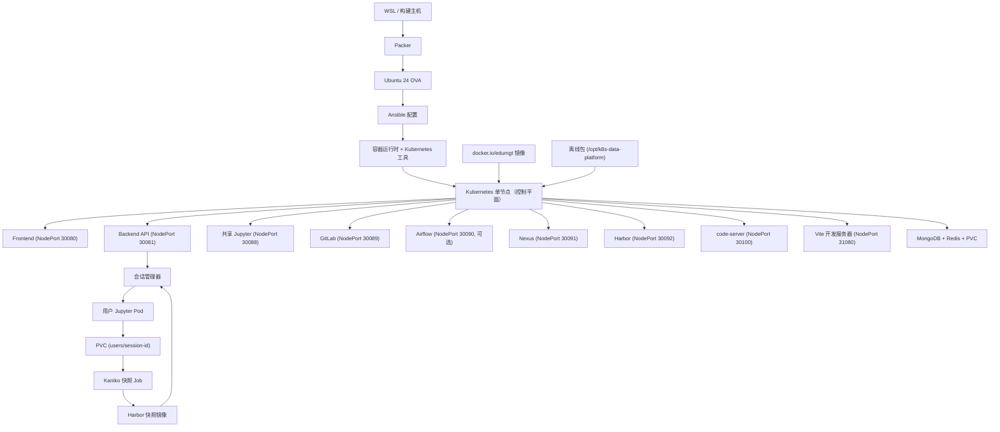
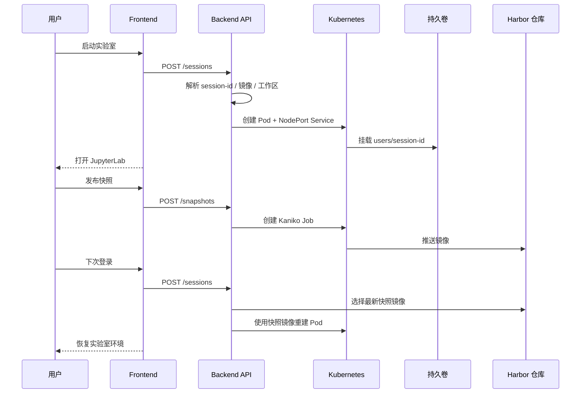

# k8s-data-platform-ova

🌐 [English](README.en.md) | **中文** | [日本語](README.ja.md) | [한국어](README.md)

本仓库提供一个基于 `Ubuntu 24 OVA → kubeadm 单节点 Kubernetes → 平台工作负载` 架构的实验/生产平台。运行基准**不是** Docker Compose，而是 `Kubernetes manifest + kustomize overlay + kubeadm/bootstrap`。OVA 内预置了 Docker Engine、containerd、kubeadm、kubelet、kubectl、vim、curl、Node.js、Python、镜像缓存以及离线包。

本 README 在 Kubernetes 核心说明基础上，还着重介绍以下运维视角：

- OVA 导入 VirtualBox / VMware 后即可测试的完整流程
- 隔离网络（离线）环境的服务访问方式
- Frontend 开发环境（`code-server`、`Vite`、`npm offline`）使用步骤
- 离线包导入 / 验证清单

核心需求实现：

- 每用户 JupyterLab 会话以 Kubernetes Pod/Service 形式创建
- 每用户工作区通过 `PVC subPath` 持久化
- 工作区通过 Kaniko Job 快照为 Harbor 镜像
- 下次登录时优先使用 Harbor 快照镜像恢复
- 平台公共镜像从 `docker.io/edumgt/*` 拉取
- OVA 内预置 Docker Engine、工具、平台镜像及离线库包

## Kubernetes 架构

当前技术栈为纯 Kubernetes。

- 宿主运行时：`Ubuntu 24`
- 集群：基于 `kubeadm` 的单节点 Kubernetes
- 部署基准：`infra/k8s/base` + `infra/k8s/overlays/dev|prod`
- 工作负载：`backend`、`frontend`、`mongodb`、`redis`、`airflow（可选）`、`jupyter`、`gitlab`、`gitlab-runner`、`nexus`
- 用户 Jupyter 会话：backend 通过 Kubernetes API 为每个用户创建 Pod/Service

## 目录结构

```text
.
├── apps/
│   ├── airflow/          # Airflow 镜像 + DAG
│   ├── backend/          # FastAPI + k8s 会话/快照控制
│   ├── frontend/         # Quasar(Vue 3) 仪表盘
│   └── jupyter/          # JupyterLab 镜像 + 工作区引导
├── ansible/              # OVA 宾客配置，Docker/Kubernetes/引导
├── infra/
│   ├── harbor/           # Harbor 快照集成说明
│   └── k8s/              # base manifests + dev/prod overlays + runner overlay
├── packer/               # Ubuntu 24 OVA 模板
└── scripts/              # 构建/发布/应用/离线辅助脚本
```

## 架构流程图



## Jupyter 快照时序



## 快速开始

### 1. 准备 OVA 变量

```bash
cp packer/variables.pkr.hcl.example packer/variables.pkr.hcl
```

### 2. 构建 OVA

```bash
bash scripts/run_wsl.sh --skip-export
```

一步完成包含 OVA 导出：

```bash
bash scripts/run_wsl.sh
```

### 3. Docker Hub 镜像 + 本地 Kubernetes 运行时导入

```bash
bash scripts/build_k8s_images.sh --namespace edumgt --tag latest
```

推送到 Docker Hub：

```bash
docker login
bash scripts/publish_dockerhub.sh --namespace edumgt --tag latest
```

### 4. 应用 Kubernetes

```bash
bash scripts/apply_k8s.sh --env dev
```

重置后重新应用：

```bash
bash scripts/reset_k8s.sh --env dev
bash scripts/apply_k8s.sh --env dev
```

检查状态：

```bash
bash scripts/status_k8s.sh --env dev
```

### 5. GitLab Runner overlay

```bash
bash scripts/apply_k8s.sh --env dev --with-runner
kubectl scale deployment/gitlab-runner -n data-platform-dev --replicas=1
```

### 6. Nexus 离线仓库

```bash
bash scripts/apply_k8s.sh --env dev
bash scripts/setup_nexus_offline.sh --namespace data-platform-dev --nexus-url http://127.0.0.1:30091
```

## OVA 导入后测试

VMware 专用流程：[docs/vmware/README.md](docs/vmware/README.md)

### 推荐 VM 配置

- CPU：4 核或以上
- 内存：16 GB 或以上
- 磁盘：100 GB 或以上
- 网卡：推荐 `Bridged Adapter`

### Web 访问

- Frontend：`http://<OVA_IP>:30080`
- Backend：`http://<OVA_IP>:30081`
- Jupyter：`http://<OVA_IP>:30088`
- GitLab：`http://<OVA_IP>:30089`
- Nexus：`http://<OVA_IP>:30091`
- Harbor：`http://<OVA_IP>:30092`
- code-server：`http://<OVA_IP>:30100`
- Frontend 开发：`http://<OVA_IP>:31080`

## Frontend / API

- 登录账号
  - 普通用户：`test1@test.com / 123456`
  - 普通用户：`test2@test.com / 123456`
  - 管理员：`admin@test.com / 123456`
- 普通用户只能启动/停止/恢复自己的 Jupyter sandbox
- 管理员在管理模式下查看每个用户的 sandbox 状态、会话时长、累计使用时长、登录次数和启动次数
- Backend API 端点：
  - `POST /api/auth/login`
  - `GET /api/auth/me`
  - `POST /api/auth/logout`
  - `POST /api/jupyter/sessions`
  - `GET /api/jupyter/sessions/{username}`
  - `DELETE /api/jupyter/sessions/{username}`
  - `GET /api/jupyter/snapshots/{username}`
  - `POST /api/jupyter/snapshots`
  - `GET /api/admin/sandboxes`

## Frontend 开发环境

本 OVA 不仅提供生产 Frontend，还提供**隔离网络内的 Vue 开发环境**。

- 生产 Frontend：Kubernetes NodePort `30080`
- 开发 Frontend：Vite 开发服务器 `31080`
- IDE：`code-server` `30100`
- 包供应：Nexus npm registry + 离线 npm 缓存

### 访问 code-server

```text
http://<OVA_IP>:30100
```

打开路径：

```text
/opt/k8s-data-platform/apps/frontend
```

### 安装依赖

```bash
bash /opt/k8s-data-platform/scripts/frontend_dev_setup.sh
```

### 启动开发服务器

```bash
bash /opt/k8s-data-platform/scripts/run_frontend_dev.sh
```

浏览器访问：`http://<OVA_IP>:31080`

## 离线 / 隔离网络策略

1. 使用 OVA 内预加载的镜像和工具启动基础集群
2. 从 `offline-bundle` 导入所需镜像/包
3. 通过 Nexus 提供 Python / npm 包缓存
4. Harbor 仅用作每用户快照仓库
5. 所有外部访问通过 `NodePort`

```bash
bash scripts/prepare_offline_bundle.sh --out-dir dist/offline-bundle
bash scripts/import_offline_bundle.sh --bundle-dir dist/offline-bundle --apply --env dev
```

## 主要 NodePort

| 服务 | NodePort |
|---|---|
| Frontend | 30080 |
| Backend API | 30081 |
| JupyterLab | 30088 |
| GitLab Web | 30089 |
| Airflow | 30090 |
| Nexus | 30091 |
| Harbor | 30092 |
| code-server | 30100 |
| Frontend Dev (Vite) | 31080 |
| GitLab SSH | 30224 |

## 镜像策略

- `docker.io/edumgt/k8s-data-platform-backend:latest`
- `docker.io/edumgt/k8s-data-platform-frontend:latest`
- `docker.io/edumgt/k8s-data-platform-airflow:latest`
- `docker.io/edumgt/k8s-data-platform-jupyter:latest`

Harbor **仅**用作每用户 Jupyter 快照仓库，不作为通用镜像仓库。

## VirtualBox 多节点扩展

从现有控制平面 VM 自动创建/加入/分配 3 个 worker VM：

```powershell
powershell -ExecutionPolicy Bypass -File .\scripts\bootstrap_virtualbox_multinode.ps1 `
  -ControlPlaneVmName k8s-data-platform `
  -WorkerNamePrefix k8s-worker `
  -WorkerCount 3 `
  -Username ubuntu `
  -Password ubuntu `
  -ForceRecreateWorkers
```

多节点 overlay 路径：`infra/k8s/overlays/dev-multinode`

```bash
bash scripts/apply_k8s.sh --env dev --overlay dev-multinode
```

## GitHub Actions

- Workflow：`.github/workflows/publish-images.yml`
- 所需 Secrets：`DOCKERHUB_USERNAME`、`DOCKERHUB_TOKEN`

## OVA 验证（2026-03-18）

- VM 控制台截图：`docs/screenshots/ova-proof-vm-console.png`
- 完整验证日志：[docs/ova-proof-20260318.md](docs/ova-proof-20260318.md)

已知问题：`nexus` pod 镜像拉取失败，`docker.io/edumgt/platform-nexus3:3.90.1-alpine` 无法拉取。

---


---

## 💖 赞助 / Sponsor

如果本项目对您有帮助，欢迎通过赞助支持持续开发。

[](https://github.com/sponsors/edumgt)
[](https://buymeacoffee.com/edumgt)

赞助资金用于：

- 云基础设施运营成本（CI/CD、镜像仓库、测试环境）
- 新功能开发与维护
- 文档改进和多语言支持
- 教育内容和教程制作

> 感谢您的支持！您的赞助让这个项目持续成长。
